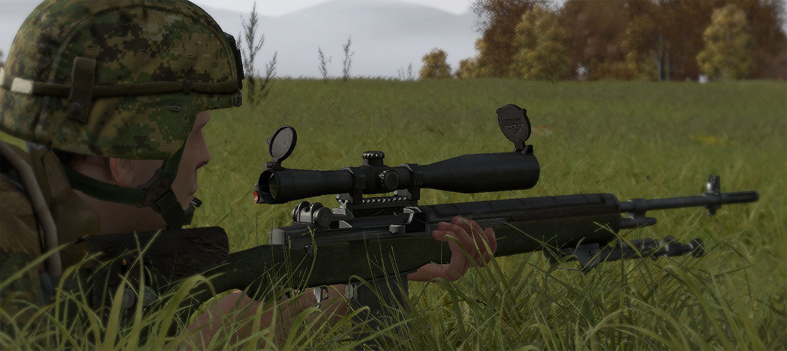
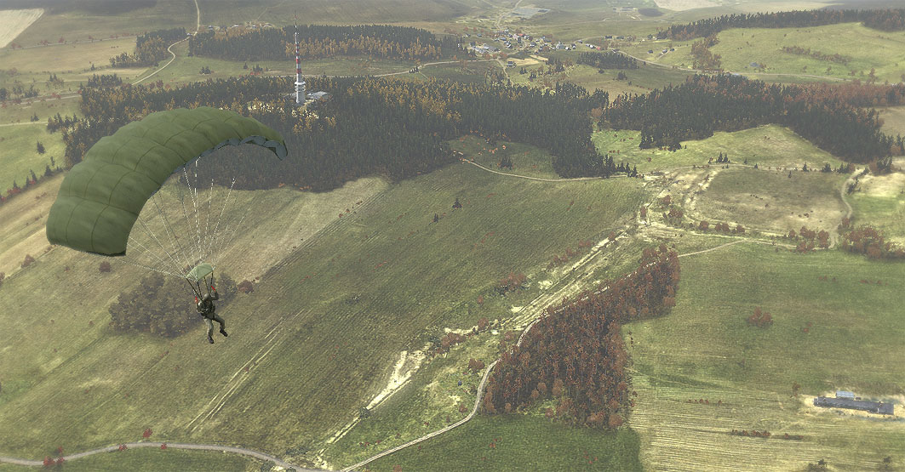
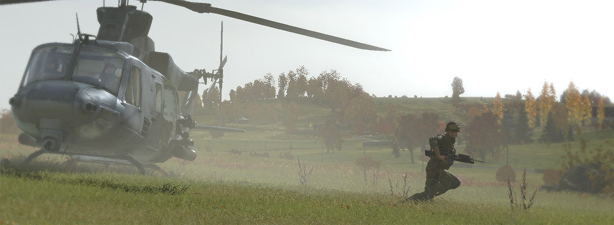
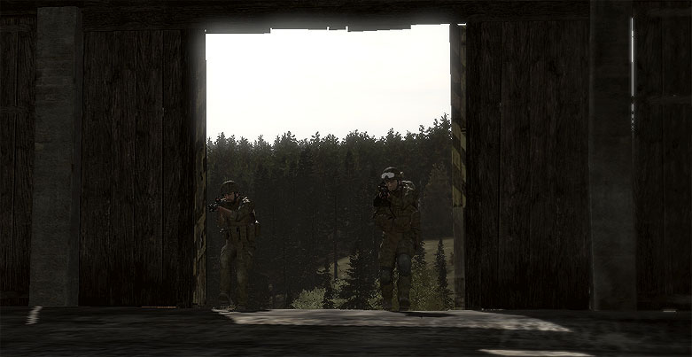
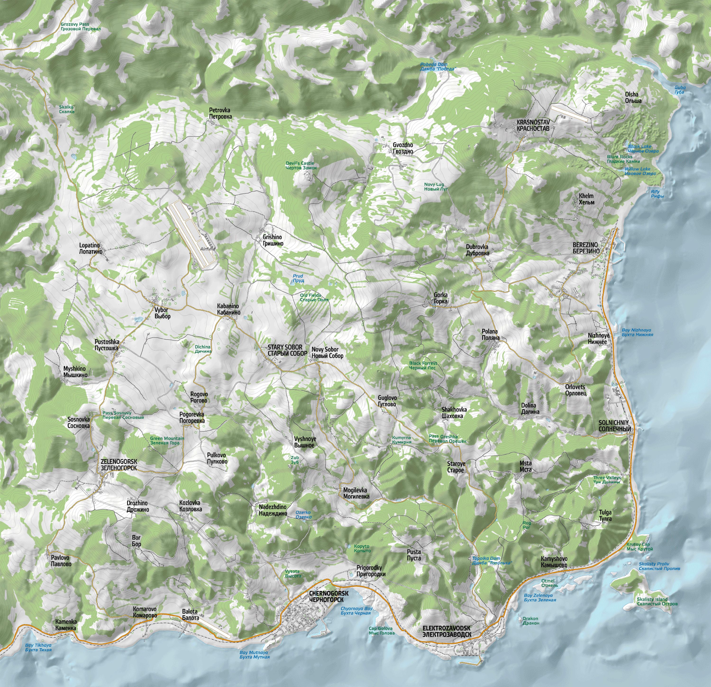
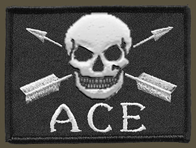

Вступление
==========

О руководстве
-------------

В этом разделе я постараюсь объяснить что это за руководство, для кого оно создавалось и с какой целью.

Это руководство является переводом `"Dslyecxi's ArmA2 Tactics, Techniques & Procedures Guide for Shack Tactical" <http://ttp2.dslyecxi.com/>`_ и я считаю, что dslyecxi проделал отличную работу и беру его руководство за основу для адаптации под свою `группу UTG <https://tacticalgaming.kiev.ua>`_.

Цель
----

ля начала, давайте поговорим о цели создания этого руководства. Arma2 "Руководство по тактике, методам и процедурам" (Tactics, Techniques, and Procedures Guide), также известное как "TTP2", создано в качестве продолжения успешного руководства для ArmA1, которое очень помогло группе Shack Tactical и моей, UTG. Хорошо обоснованная справочная доктрина о том, что мы представляем собой как группа - это значительный фактор, который определял получаемое от игры в ArmA1 удовольствие на протяжении двух лет. Оно показало нам общее понимание различных аспектов того, как нужно играть, позволило легко принимать новых игроков и, в целом, многое упростило и улучшило. Это и является причиной написания, именно поэтому я обновил руководство, получив в результате то, что вы сейчас читаете.

Теперь я объясню, почему я размещаю это руководство на всеобщее обозрение полностью безвозмездно. Я истинно верю в подобный стиль игры и я, также, верю, что подобного рода информация должна быть распространена как можно шире в интересах всех, без предвзятости или ограничений, а не закрыта в частном форуме. Чтобы всем было интересно играть в такие игры как ArmA2. Даже тогда, когда dslyecxi начал продавать печатную версию этого руководства для A1, он никогда не убирал бесплатную версию. И он не собирается что-либо менять и в этот раз.

Это руководство доступно всем, у кого есть время, чтобы его прочитать - я с радостью предлагаю его и надеюсь, что каждый вынесет из него что-то для себя. Сильное сообщество полезно для всех нас и, если это руководство поможет этому в какой-либо мере, я буду считать это большим успехом.

Хочу обратиться к тем, кто читает это. Если вам нравится это руководство, я прошу вас рассказать о нём всем, кому оно может быть полезно. Устное распространение всегда было моим любимым и каждый приветствуется к участию в нём.

Не забывайте, что это руководство не является "единственным правильным". Оно просто отражает принципы организации игры в ShackTac и UTG, где оно отлично работает. Надеюсь, что вы также найдёте полезные советы для вашего стиля игры.

Что нового?
-----------

Тем, кто читал моё первое руководство, я хочу рассказать об изменениях.

Основной источник изменений - это большая готовая база (TTP1), а также огромное количество опыта, полученного в процессе игры в ArmA1. Я использовал всё это для подготовки нового материала, а также обновления существующего.

В результате получилось следующее - содержимое более насыщено информацией, лучше организовано и легче усваивается. Важным темам, таким как лидерство и тактика, уделено больше внимания. И это ещё не всё - все части руководства были сильно переделаны и расширены. Если вы читали первую часть, то вы обязательно должны найти что-то новое и интересное для себя.

Первое руководство содержало больше 60,000 слов. В новом руководстве это число удвоилось и равно, приблизительно, 120,000, и я думаю, вы увидите, что эти 120,000 слов действительно содержат большое количество информации, относящейся именно к ArmA2. Также вы не встретите здесь "военной болтологии". Но об этом далее.

Реальность против виртуальности
-------------------------------

Военное моделирование и ошибки
^^^^^^^^^^^^^^^^^^^^^^^^^^^^^^

Как и ранее, цель этого руководства - передать то, что по-настоящему имеет отношение к стилю реалистичного-интересного боевого моделирования группы Shack Tactical. Это та информация, которую наши игроки используют в каждой игре, чтобы работать как хорошо слаженная, разнообразная команда. У нас всегда была своя очень практичная и прагматичная точка зрения на "milsim" (military simulation, то есть военное моделирование) и мы принимали все возможные меры, чтобы избежать делания чего-то просто "потому, что это делают настоящие военные" и, таким образом, превращая игру в то, что мы называем "хардкорный milsim".

С нашей точки зрения, хардкорный milsim (который очень часто просто называют "milsim") - это просто "тактическая болтология", которая не имеет отношения к играм. В хардкорных milsim это обычно проявляется в избыточных правилах, инструкциях, попытках воссоздания настоящей военной структуры званий, которая совсем не подходит для рамок обычной среднестатистической миссии в ArmA, деланием вещей просто потому, "что настоящие военные делают их", независимо от реальной необходимости их применения в игре, и других моментах, которые, по нашему мнению, не имеют применения в подобных играх.

Это руководство также отражает подобный тип мышления. Ещё до написания первого руководства я отметил один момент - игровые военные руководства очень часто скрывают в себе два подводных камня. Первый - использование настоящей военной литературы без отделения зёрен (информации, которую можно отнести к играм) от плевел (настоящие военные процедуры, которые не имеют значения или не моделируются в играх). Прошу, не поймите меня неправильно - можно очень многое узнать и взять из военных публикаций и полевых руководств. Это руководство также содержит очень много ссылок на подобные военные учебники, но не повторяет их слово в слово, так как это не имеет смысла. Информация, которая представлена здесь, по настоящему имеет отношение к игре, так как мы использовали её на своём личном опыте, на протяжении нескольких лет игры.

Военные полевые руководства и издания могут быть очень интересны тем, кто заинтересован в подобном реализме. Учитывая это, я предоставил ссылки для большинства из них. Это необязательно, но, если вам любопытно узнать, как настоящие военные делают своё дело, или просто хотите больше узнать о конкретной теме, я советую вам загрузить их и посмотреть. Вы найдёте ссылки на последней странице руководства.

Также, следует учитывать, что миссии, которые мы чаще всего встречаем в игре, в реальном мире требуют огромных усилий по части планирования и подготовки профессиональным военным персоналом до того, как будет сделан первый выстрел. Основная цель таких групп как моя - сыграть как можно лучше без огромных затрат времени на предварительное планирование - в частности, мы хотим получить наилучшие результаты без часов обдумывания каждой операции. Планирование - это отлично, но мы пытаемся ограничиться минутами, не более, разрабатывая план действий по ходу миссии. В конце концов, как говорится "Все планы рушатся при первом контакте".

Второй подводный камень - игровые упрощения. "Игровые" руководства основаны на очень точных данных, которые не существуют в реальности, например, список всех танков с их значениями брони и точные значения 'повреждений' противотанкового оружия. Подобные "игровые" руководства склоняют к использованию тактики, которая эксплуатирует правила самой игры. Я не верю в подобные руководства, если вам они нравится, то лучше поищите в другом месте.

Удовольствие - основная цель
^^^^^^^^^^^^^^^^^^^^^^^^^^^^

Напоследок стоит повторить ещё раз, что мы играем в игры. Цель - это повеселиться - в нашем случае, повеселиться организованно и дисциплинированно. Мы не притворяемся, что мы в армии - многие и так были там, и делали всё это, или всё ещё делают. Мы играем в ArmA2 и хорошо проводим время. В конечном счёте, мы сообщество друзей и это самое главное. Это руководство написано в таком духе.

Просьба
-------

Если вы читаете это, у меня есть одна просьба - как только вы закончите, посмотрите `последнюю страницу оригинального руководства <http://ttp2.dslyecxi.com/finale.html>`_. В частности, просмотрите опрос. Потраченная вами минута на заполнение этого опроса будет много значить для dslyecxi - это поможет ему узнать, каким образом развивать подобные тренировочные руководства в дальнейшем.

Использование этого руководства
-------------------------------

После размещения первого руководства ArmA TTP, я был приятно удивлён количеством других групп, которые захотели использовать большую часть этого руководства для себя. Кроме всего прочего, поступило несколько просьб о разрешении на перевод.

Если вы заинтересованы в использовании его как части своего руководства или для перевода на другой язык, пожалуйста, не медлите и напишите по адресу .

Если вы хотите использовать этот перевод, напишите по адресу messiah @ этот_домен.

Примечания
----------

* **Это руководство не включает в себя различие тактики против ИИ или человека.** Очевидно, что некоторые тактики ИИ не будет использовать. Руководство написано на "высшем уровне" - это означает, что оно не "геймерское" (с использованием слабостей ИИ), а рассчитано на пвп игру. Никогда не повредит предположить, что противник умнее, чем может быть, просто на всякий случай. Мы играем в два типа игр (друг против друга и кооператив) и всегда делаем это 'тактически правильно', так как часто воюем друг против друга, и знаем, что в этом случае медлить нельзя, если хочешь выиграть.
* **Некоторые аспекты этого руководства основаны на опыте игры с реалистичным модом Advanced Combat Environment (ACE)** и могут быть неуместны, пока он не будет готов для ArmA2.
* **Есть очень много хороших идей, применимых к реальному сражению или медленному, более методичному пошаговому стилю игры, которые практически не пригодны для больших групп**. Я приложил все усилия, чтобы показать различные тактики, которые могут применить группы даже со средним опытом игры

О Shack Tactical и UTG
----------------------

**UTG** (Ukrainian Tactical Gaming) - это группа, которую я создал для организации игр в Armed Assault, а в данный момент в ArmA2. Практически всё, что касается этой группы, вдохновлено группой `Shack Tactical <http://dslyecxi.com/shacktac.html>`_, основателем которой является **dslyecxi**. Именно его `сайт <http://www.dslyecxi.com/>`_, `описания <http://dslyecxi.com/articles/wgl_warfle.html>`_, история и принципы его группы легли в основу UTG.

Далее краткая информация о Shack Tactical от лица самого dslyecxi:

`Shack Tactical <http://www.shacktac.com/>`_ - это группа, которая играла в Operation Flashpoint, потом в Armed Assault и сейчас в ArmA2.

Основной принцип - развитие и содержание зрелой, но в тоже время весёлой группы, объединенной одним общим интересом - реалистичное боевое моделирование. Я уверен, что многие уже знакомы с некоторыми из наших "дебрифингов по играм" и видели видео записи. Если же нет, но вам интересно, вы можете найти отчёты на мой странице статей, а видео - на моём `Youtube аккаунте <http://www.youtube.com/user/Dslyecxi>`_.

На время написания, ShackTac играла в ArmA1 уже два года, а до этого - в Operation Flashpoint больше года. В это время мы очень сильно развились как группа. Всё наше развитие основано на опыте игр и я изо всех сил пытался избегать всего лишнего или того, что могло всё слишком усложнить и негативно отразиться на игре.

Не все мы настоящие солдаты (хотя, многие, например, я сам, служили в прошлом или сейчас на службе), и мы не притворяемся. Несмотря на это, нам нравится сражаться как сплочённая, опытная и тактически подготовленная группа объединённых схожими интересами игроков.

Это руководство создано для того, чтобы помочь расширить наш игровой опыт и представить его широкой общественности в надежде на то, что это хоть немного повлияет на тактическое игровое сообщество.

Я надеюсь, что всем вам понравится читать это руководство. Многие участники ShackTac помогали в его создании, и, как я говорил, всё это не было бы возможно без игрового опыта нашей группы, накопленного за последние годы.

О игре ArmA2
------------

Для тех, кто не знает, что такое ArmA2, вкратце - это смешанный военный симулятор с невероятным размахом и непревзойдённой возможностью воссоздания крупномасштабных военных конфликтов. В дополнение, это необычайно настраиваемая и конфигурируемая игра - в ней присутствует отличный редактор миссий и собственный скриптовый язык, а также утилиты для создания любых юнитов, оружия, техники, территорий и тд.

ArmA2 следует по стопам ArmA1 и Operation Flashpoint, предлагая нам самый реалистичный на данный момент опыт общевойскового боя от простого пехотинца до любой военной техники без исключения. Это военная песочница, которую можно полностью настроить под себя.

Кроме всего прочего, ArmA2 обладает большим количеством многопользовательских возможностей. Она в состоянии справиться с сотней (или даже больше с хорошим “железом”) игроков в одной миссии одновременно, играя как друг против друга, так и вместе против ИИ в кооперативных сценариях или любом другом варианте, который только можно себе вообразить. Возможности создания миссий практически безграничны, если вы сможете придумать что-то, то, скорее всего, сможете и сделать.

Как ArmA1 и OFP, ArmA2 - это игра номер один для групп Shack Tactical и UTG. Впечатления от игр за последние годы ни с чем не сравнится, и это продолжается каждую неделю, игроки приходят в больших количествах и принимают участие в новых сценариях. Мы играем всё - от серьёзных до совсем тупых сценариев и все они просто отличные. Наш групповой энтузиазм в "создании собственной игры" позволил нам развиваться всё это время на протяжении многих лет.

Я надеюсь, что любой, кто заинтересован в сетевой стороне ArmA2, найдёт себе подходящее место для игры с богатыми возможностями и хорошей компанией игроков. Я также надеюсь, что это руководство создаст необходимую базу знаний, чтобы помочь игрокам сообщества играть вместе, возможно, не "как по книге", но, хотя бы, немного лучше.

*Чернарусь, основная местность в ArmA2, размером 225 квадратных километров*

Моды
----

Если говорить о модах для ArmA2, сообщество создаёт огромное количество разнообразных модификаций. A2 предоставляет очень много новых возможностей для моддеров и очень интересно посмотреть на то, что получится за всё время жизни игры.

Уже сейчас я могу с уверенностью посоветовать один мод. Это Advanced Combat Environment 2 - сиквел к моду ArmA1 с таким же названием, который я рекламировал в первом тактическом руководстве для ArmA.

Advanced Combat Environment 2
^^^^^^^^^^^^^^^^^^^^^^^^^^^^^

ACE2 ориентирован на концепцию "весёлого реализма" - это значит, что он вводит что-то не просто потому, что это реалистично, а чтобы улучшить геймплей или удовольствие от игры. ACE1, возможно, был самым популярным и значительным модом, который вышел для ArmA1, он был запущен на многочисленных серверах и с ним играли тысячи людей.

Мод ACE1 - выбор Shack Tactical и UTG в ArmA1, который стал основой для сотен запоминающихся миссий. Я не могу посоветовать что-либо другое - это золотой стандарт геймплея, ничто не сравнилось с ним до сих пор.

Команда мода ACE постоянно улучшает его и уже готова сделать следующий шаг к ACE2. Все подробности пока неизвестны, но некоторые моменты из ACE2 разбросаны по этому руководству (отмечены логотипом). Такие, как система выносливости (усталости), оружие и другие особенности геймплея - такие, как упор оружия на предметах, улучшенная баллистика ракет, улучшенная система пробивания и многое другое.

ACE2 однозначно тот мод, который стоит ждать для ArmA2.

По состоянию на 2011-07-15 мод АСЕ2 уже достиг версии 1.11 и вы можете скачать и прочитать о нём на сайте http://ace.dev-heaven.net/.

